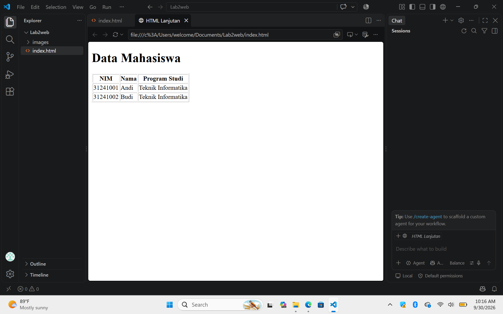
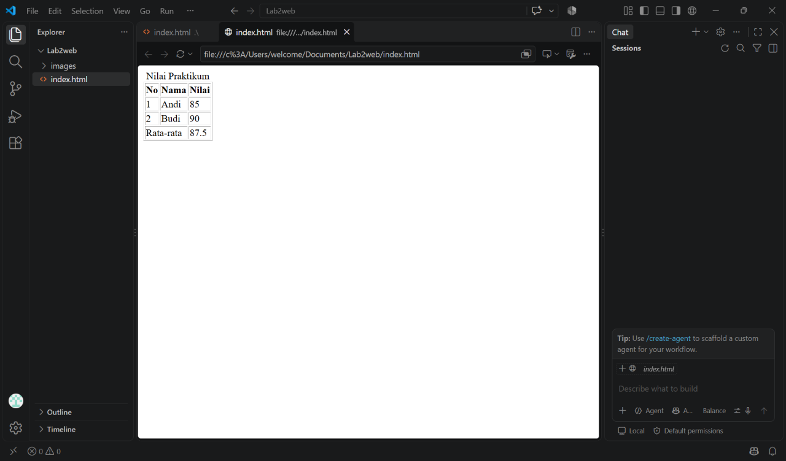
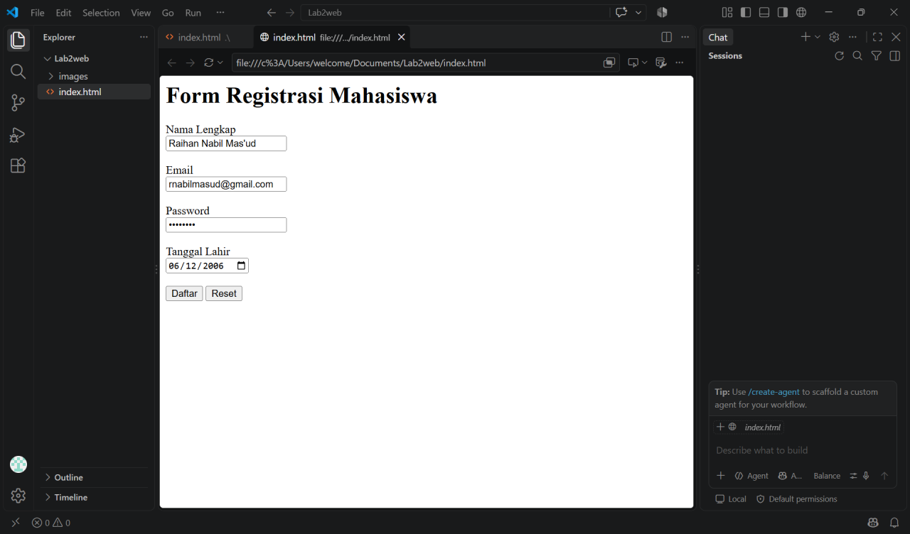
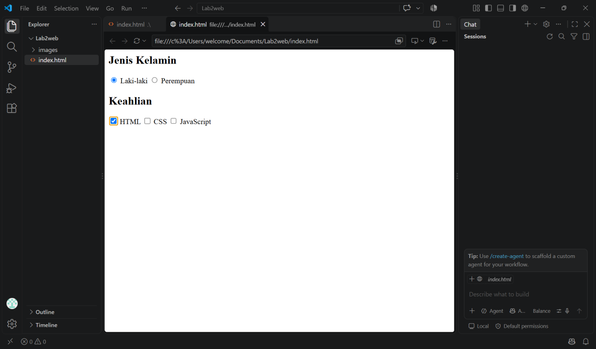
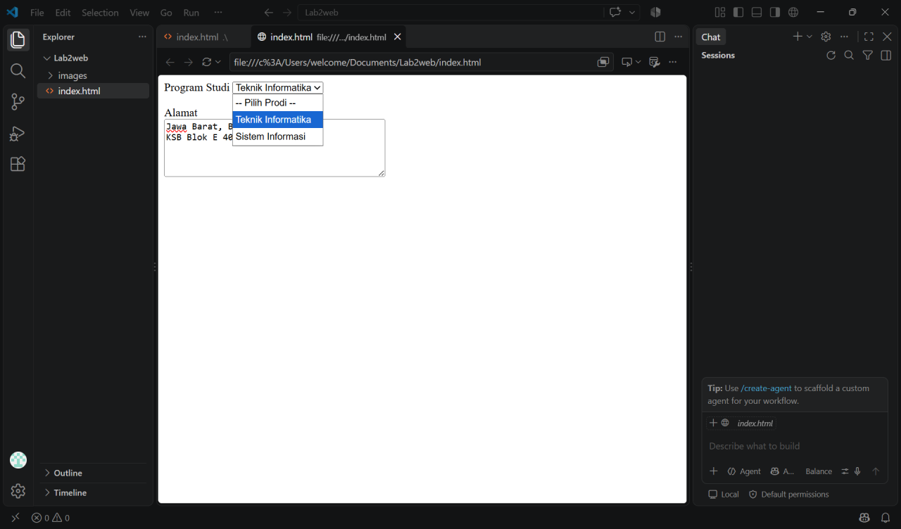
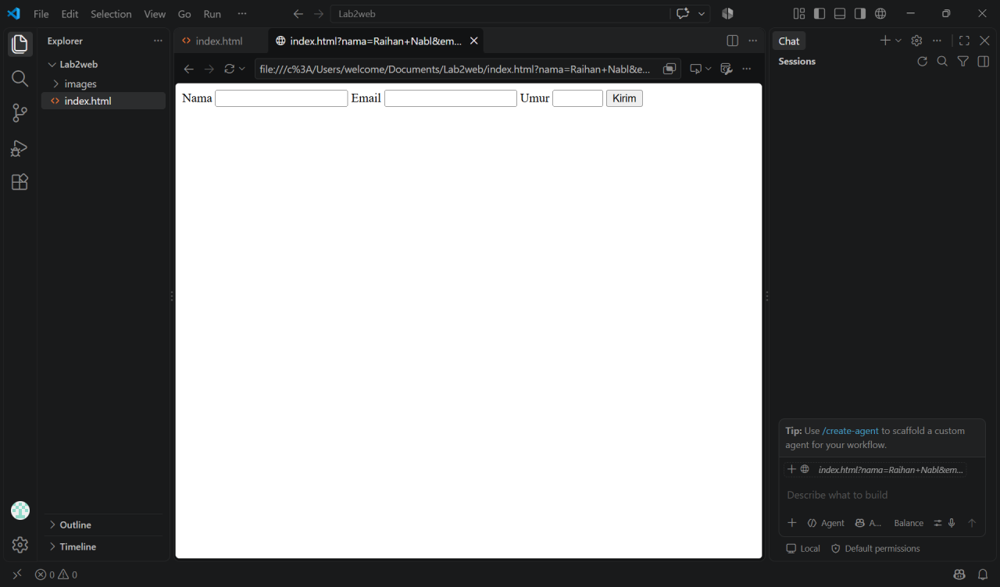
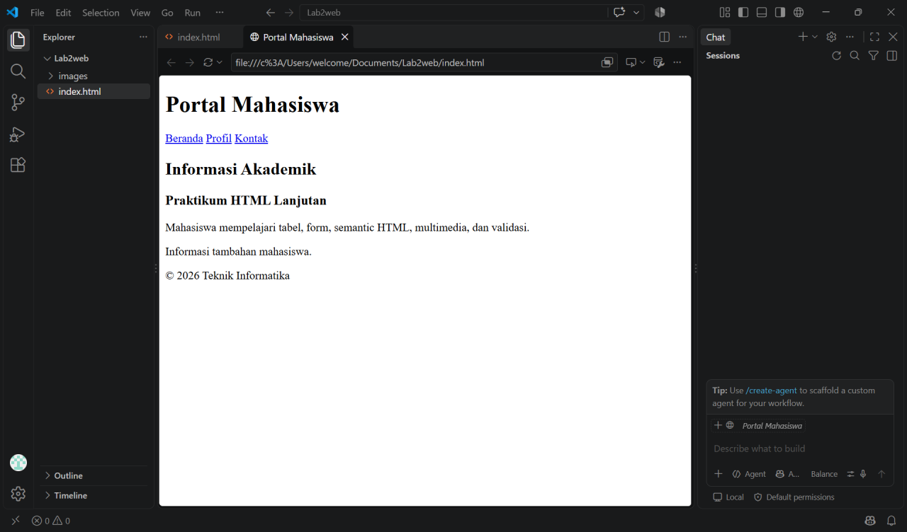
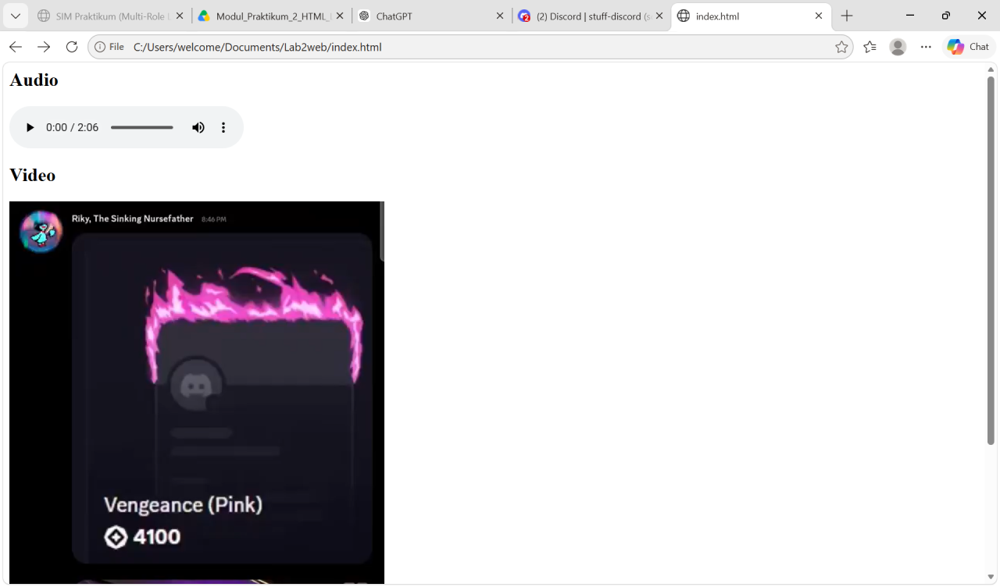
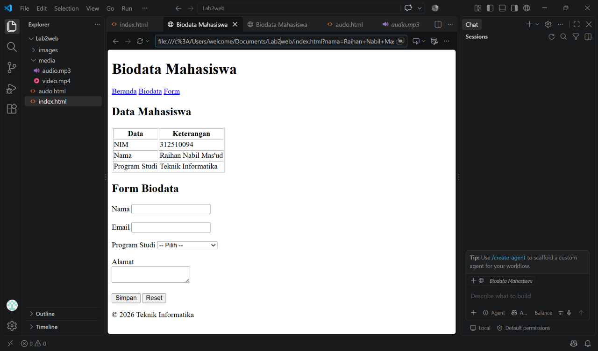

LAPORAN PRAKTIKUM 2 PEMOGRAMAN WEB
Praktikum 2 — HTML LanjutanPraktikum 2 — HTML Lanjutan
Repository ini berisi hasil Praktikum 2 Pemrograman Web dengan materi HTML Lanjutan.
Praktikum ini membahas penggunaan tabel HTML, form, berbagai jenis input, semantic HTML, multimedia, serta validasi form dasar. Praktikum dikerjakan menggunakan HTML sebagai fokus utama, tanpa menggunakan CSS dan JavaScript sebagai fokus utama.
Tujuan Praktikum
1.	Memahami penggunaan tabel pada HTML.
2.	Memahami penggunaan form dan berbagai jenis input HTML.
3.	Menerapkan semantic HTML untuk menyusun struktur halaman.
4.	Menambahkan elemen multimedia pada halaman web.
5.	Menerapkan validasi form dasar menggunakan atribut HTML.
________________________________________
Langkah-Langkah Praktikum
1. Membuat Tabel Data Mahasiswa
Pada langkah pertama dibuat tabel untuk menampilkan data mahasiswa menggunakan elemen <table>, <tr>, <th>, dan <td>.
Kode HTML
<!DOCTYPE html>
<html>
<head>
    <title>HTML Lanjutan</title>
</head>
<body>

    <h1>Data Mahasiswa</h1>

    <table border="1">
        <tr>
            <th>NIM</th>
            <th>Nama</th>
            <th>Program Studi</th>
        </tr>

        <tr>
            <td>31241001</td>
            <td>Andi</td>
            <td>Teknik Informatika</td>
        </tr>

        <tr>
            <td>31241002</td>
            <td>Budi</td>
            <td>Teknik Informatika</td>
        </tr>

        <tr>
            <td>31241003</td>
            <td>Citra</td>
            <td>Teknik Informatika</td>
        </tr>
    </table>

</body>
</html>
Pada modul, setelah tabel dibuat mahasiswa diminta menambahkan minimal tiga data mahasiswa.
Hasil
Tabel menampilkan data mahasiswa dalam bentuk baris dan kolom, dengan NIM, nama, dan program studi sebagai informasi utama.
Screenshot
Screenshot 1 — Tabel Data Mahasiswa

________________________________________
2. Mengembangkan Tabel dengan <thead>, <tbody>, dan <tfoot>
Pada langkah kedua tabel dikembangkan menggunakan struktur yang lebih terorganisir, yaitu:
•	<thead> untuk bagian kepala tabel.
•	<tbody> untuk data utama.
•	<tfoot> untuk bagian bawah/keterangan tabel.
•	<caption> untuk memberikan judul tabel.
Kode HTML
<table border="1">

    <caption>Nilai Praktikum</caption>

    <thead>
        <tr>
            <th>No</th>
            <th>Nama</th>
            <th>Nilai</th>
        </tr>
    </thead>

    <tbody>
        <tr>
            <td>1</td>
            <td>Andi</td>
            <td>85</td>
        </tr>

        <tr>
            <td>2</td>
            <td>Budi</td>
            <td>90</td>
        </tr>

        <tr>
            <td>3</td>
            <td>Citra</td>
            <td>88</td>
        </tr>
    </tbody>

    <tfoot>
        <tr>
            <td colspan="2">Rata-rata</td>
            <td>87.67</td>
        </tr>
    </tfoot>

</table>
Modul juga meminta melakukan eksperimen dengan mengubah data, menambahkan baris, serta menggunakan colspan untuk menggabungkan sel.
Penjelasan colspan
Atribut colspan digunakan untuk membuat satu sel tabel menempati beberapa kolom.
Contohnya:
<td colspan="2">Rata-rata</td>
Artinya sel Rata-rata akan menempati dua kolom.
Hasil
Tabel memiliki struktur header, data utama, dan footer. Pada bagian footer, dua kolom digabung menggunakan colspan.
Screenshot

 
________________________________________
3. Membuat Form Registrasi Mahasiswa
Form digunakan untuk menerima data dari pengguna.
Pada praktikum dibuat form registrasi mahasiswa yang memiliki input:
•	Nama lengkap
•	Email
•	Password
•	Tanggal lahir
•	Tombol Daftar
•	Tombol Reset
Kode HTML
<h1>Form Registrasi Mahasiswa</h1>

<form>

    <label for="nama">Nama Lengkap</label> 
    <input type="text" id="nama" name="nama">

      

    <label for="email">Email</label> 
    <input type="email" id="email" name="email">

      

    <label for="password">Password</label> 
    <input type="password" id="password" name="password">

      

    <label for="tanggal">Tanggal Lahir</label> 
    <input type="date" id="tanggal" name="tanggal">

      

    <button type="submit">Daftar</button>
    <button type="reset">Reset</button>

</form>
Kode tersebut mengikuti contoh form registrasi yang terdapat pada modul.
Hasil
Form memungkinkan pengguna memasukkan informasi pribadi melalui beberapa jenis input HTML.
Screenshot
 
 
________________________________________
4. Radio Button dan Checkbox
Langkah keempat mempraktikkan penggunaan radio button dan checkbox.
Radio Button
Radio button digunakan untuk memilih satu pilihan dari beberapa pilihan yang memiliki name yang sama.
<h2>Jenis Kelamin</h2>

<input type="radio" id="laki" name="jk" value="L">
<label for="laki">Laki-laki</label>

<input type="radio" id="perempuan" name="jk" value="P">
<label for="perempuan">Perempuan</label>
Checkbox
Checkbox digunakan untuk memilih satu atau beberapa pilihan.
<h2>Keahlian</h2>

<input type="checkbox" id="html" name="skill" value="HTML">
<label for="html">HTML</label>

<input type="checkbox" id="css" name="skill" value="CSS">
<label for="css">CSS</label>

<input type="checkbox" id="js" name="skill" value="JavaScript">
<label for="js">JavaScript</label>
Contoh penggunaan radio button dan checkbox tersebut sesuai dengan langkah praktikum pada modul.
Hasil
Radio button memungkinkan pengguna memilih satu jenis kelamin, sedangkan checkbox memungkinkan pengguna memilih lebih dari satu keahlian.
Screenshot
 
 
________________________________________
5. Select dan Textarea
Langkah kelima menggunakan <select> untuk memilih program studi dan <textarea> untuk memasukkan alamat.
Kode HTML
<label for="prodi">Program Studi</label>

<select id="prodi" name="prodi">
    <option value="">-- Pilih Prodi --</option>
    <option value="ti">Teknik Informatika</option>
    <option value="si">Sistem Informasi</option>
</select>

  

<label for="alamat">Alamat</label> 

<textarea
    id="alamat"
    name="alamat"
    rows="5"
    cols="40">
</textarea>
Modul menggunakan <select> dengan pilihan Teknik Informatika dan Sistem Informasi serta <textarea> untuk alamat.
Hasil
Pengguna dapat memilih program studi dari daftar pilihan dan memasukkan alamat dalam area teks yang lebih besar.
Screenshot
 
 
________________________________________

6. Validasi Form Dasar
HTML menyediakan validasi dasar melalui beberapa atribut, seperti:
•	required
•	minlength
•	maxlength
•	min
•	max
•	type
•	pattern
Pada langkah ini digunakan required, minlength, min, dan max.
Kode HTML
<form>

    <label for="nama">Nama</label>
    <input
        type="text"
        id="nama"
        name="nama"
        required
        minlength="3">

      

    <label for="email">Email</label>
    <input
        type="email"
        id="email"
        name="email"
        required>

      

    <label for="umur">Umur</label>
    <input
        type="number"
        id="umur"
        name="umur"
        min="17"
        max="60"
        required>

      

    <button type="submit">Kirim</button>

</form>
Pengujian
Coba tekan tombol Kirim tanpa mengisi data. Browser akan memberikan pesan validasi karena beberapa input memiliki atribut required.
Selain itu:
•	Nama harus memiliki minimal 3 karakter.
•	Umur harus berada antara 17 dan 60.
•	Email harus menggunakan format email yang valid.
Instruksi untuk mencoba validasi tersebut terdapat pada modul.
Screenshot
 
 
________________________________________
7. Membuat Halaman Semantic HTML
Semantic HTML digunakan untuk membuat struktur halaman yang memiliki makna yang jelas.
Elemen yang digunakan:
•	<header> — kepala halaman atau bagian.
•	<nav> — navigasi.
•	<main> — konten utama.
•	<section> — kelompok konten.
•	<article> — konten mandiri.
•	<aside> — konten pelengkap.
•	<footer> — bagian kaki halaman.
Fungsi masing-masing elemen tersebut dijelaskan dalam modul.
Kode HTML
<!DOCTYPE html>
<html>

<head>
    <title>Portal Mahasiswa</title>
</head>

<body>

    <header>
        <h1>Portal Mahasiswa</h1>
    </header>

    <nav>
        <a href="#">Beranda</a>
        <a href="#">Profil</a>
        <a href="#">Kontak</a>
    </nav>

    <main>

        <section>
            <h2>Informasi Akademik</h2>

            <article>
                <h3>Praktikum HTML Lanjutan</h3>

                

                    Mahasiswa mempelajari tabel, form,
                    semantic HTML, multimedia, dan validasi.
                

            </article>
        </section>

        <aside>
            Informasi tambahan mahasiswa.
        </aside>

    </main>

    <footer>
        
&copy; 2026 Teknik Informatika

    </footer>

</body>

</html>
Kode tersebut mengikuti struktur semantic HTML pada langkah ketujuh modul.
Hasil
Halaman memiliki struktur yang lebih jelas karena bagian navigasi, konten utama, artikel, informasi tambahan, dan footer dipisahkan berdasarkan fungsi masing-masing.
Screenshot
 
 
________________________________________
8. Menambahkan Multimedia
HTML menyediakan elemen <audio> dan <video> untuk menampilkan multimedia pada halaman web.
Struktur Folder
praktikum-2-html-lanjutan/
├── index.html
└── media/
    ├── audio.mp3
    └── video.mp4
Struktur folder tersebut sesuai dengan contoh pada modul.
Audio
<h2>Audio</h2>

<audio controls>
    <source src="media/audio.mp3" type="audio/mpeg">
    Browser tidak mendukung audio.
</audio>
Video
<h2>Video</h2>

<video controls width="480">
    <source src="media/video.mp4" type="video/mp4">
    Browser tidak mendukung video.
</video>
Hasil
Halaman dapat menampilkan file audio dan video menggunakan elemen HTML5 <audio> dan <video>.
Screenshot
 
 
________________________________________
9. Proyek Mini — Form Biodata Mahasiswa
Pada proyek mini, seluruh materi yang telah dipelajari digabungkan menjadi satu halaman biodata mahasiswa.
Proyek ini mencakup:
•	Semantic HTML
•	Tabel data
•	Form
•	Validasi dasar
•	Select
•	Textarea
•	Multimedia
Modul secara langsung meminta mahasiswa menggabungkan materi tersebut dalam proyek mini biodata mahasiswa.
Kode biodata.html
<!DOCTYPE html>
<html>

<head>
    <title>Biodata Mahasiswa</title>
</head>

<body>

    <header>
        <h1>Biodata Mahasiswa</h1>
    </header>

    <nav>
        <a href="index.html">Beranda</a>
        <a href="#biodata">Biodata</a>
        <a href="#form">Form</a>
    </nav>

    <main>

        <section id="biodata">

            <h2>Data Mahasiswa</h2>

            <table border="1">

                <tr>
                    <th>Data</th>
                    <th>Keterangan</th>
                </tr>

                <tr>
                    <td>NIM</td>
                    <td>31241001</td>
                </tr>

                <tr>
                    <td>Nama</td>
                    <td>Nama Mahasiswa</td>
                </tr>

                <tr>
                    <td>Program Studi</td>
                    <td>Teknik Informatika</td>
                </tr>

            </table>

        </section>

        <section id="form">

            <h2>Form Biodata</h2>

            <form>

                <label for="nama">Nama</label>
                <input
                    type="text"
                    id="nama"
                    name="nama"
                    required>

                  

                <label for="email">Email</label>
                <input
                    type="email"
                    id="email"
                    name="email"
                    required>

                  

                <label for="prodi">Program Studi</label>

                <select
                    id="prodi"
                    name="prodi"
                    required>

                    <option value="">-- Pilih --</option>
                    <option value="ti">Teknik Informatika</option>
                    <option value="si">Sistem Informasi</option>

                </select>

                  

                <label for="alamat">Alamat</label> 

                <textarea
                    id="alamat"
                    name="alamat"
                    required>
                </textarea>

                  

                <button type="submit">Simpan</button>
                <button type="reset">Reset</button>

            </form>

        </section>

    </main>

    <footer>
        
&copy; 2026 Teknik Informatika

    </footer>

</body>

</html>
Kode proyek mini di atas mengikuti struktur yang diberikan dalam modul, termasuk semantic structure, tabel data mahasiswa, form, required, select, dan textarea.
Screenshot
 
 
________________________________________